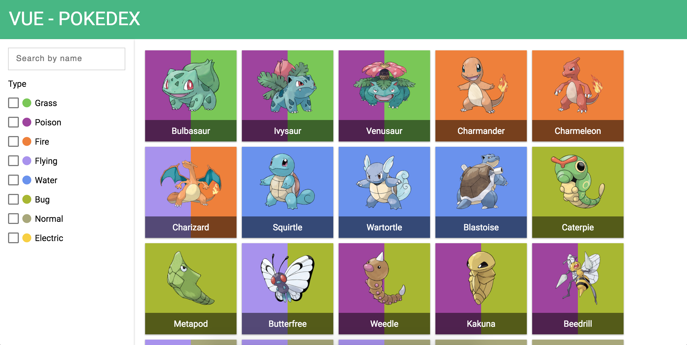

# Vue Pokedex

Just open index.html and it will work :)

### ES6 version

If you know git, checkout to the branch 'es6' for a cleaner ES6 version (but could not work in all browsers)

### Credits
Nice input from @Takumari85: https://codepen.io/Takumari85/pen/RaYwpJ

Nice checkbox from [@hansmaad](https://twitter.com/hansmaad): https://codepen.io/hansmaad/pen/qaGrQL