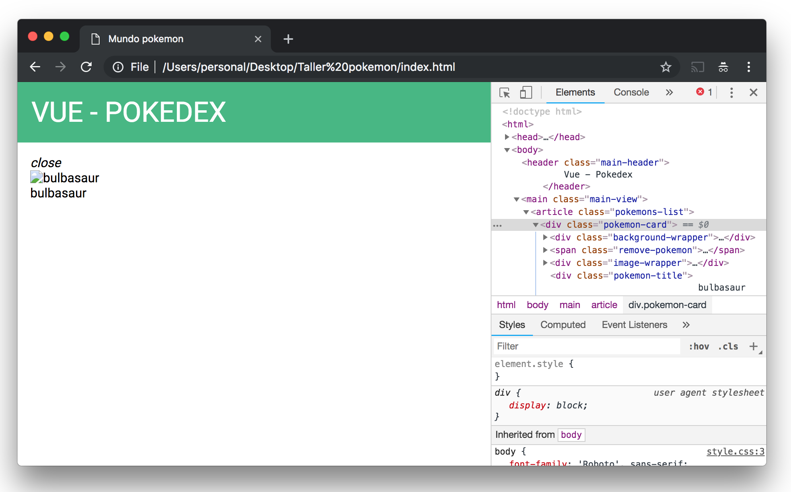

# CSS


## Índice

- [Introducción](README.md)
- [HTML](HTML.md)
- CSS
- [JavaScript](JavaScript.md)

Y aquí viene el segundo palabro raro! CSS significa Cascading Style Sheets y es el segundo lenguaje de programación que vamos a ver :) aunque de hecho... también lo hemos visto! estaba escondido debajo del HTML, justo aquí:


y es que CSS es el lenguaje de programación que nos va a ayudar a __dar estilos__ a nuestro HTML, esto quiere decir que cosas como los colores, tamaño, tipo de letra, posición... en general lo que hace "que se vea bien" una web está hecho con CSS.

### Práctica 3

Para añadir el CSS vamos a que crear un fichero que vamos a llamar `style.css` al lado del index.html y vamos a guardar unos estilos iniciales:

style.css
```css
.main-header {
    text-transform: uppercase;
    background: #42b883;
    color: white;
    font-size: 35px;
    padding: 0.5em;
    font-weight: 400;
}
```

pero si probamos a guardar y recargar la web no ocurrirá nada, esto es por que le tenemos que decir al html dónde se encuentra el archivo CSS y para ello justo después de la etiqueta `<title>Mundo pokemon</title>` añadimos:

```html
<link rel="stylesheet" href="style.css">
```

de forma que ahora sí, guardamos, recargamos y debería salir algo como esto:


si te fijas, la forma que tiene el CSS de saber a que parte del HTML afecta es con la marca que hemos puesto en el html `class="main-header"` que se relaciona con el css `.main-header`.

y si añadimos un poco más de estilos como estos:

```css
@import url('https://fonts.googleapis.com/css?family=Roboto:400,700');
@import url('https://fonts.googleapis.com/icon?family=Material+Icons');

body {
    font-family: 'Roboto', sans-serif;
    display: flex;
    min-height: 100vh;
    flex-direction: column;
    margin: 0;
}

header, article, nav, aside {
    padding: 1em;
}

.main-header {
    text-transform: uppercase;
    background: #42b883;
    color: white;
    font-size: 35px;
    padding: 0.5em;
    font-weight: 400;
}
```

conseguiremos que quede como en la página original :)


perfecto pues ya tenemos nuestro header completo!! 🎉🎊🙌

¿serías capaz de hacer las letras un poco más pequeñas y de cambiar el color de fondo por un azul? :)

## Añadiendo a Bulbasaur

Pues por fin van a aparecer los pokemon!, como hemos visto anteriormente los vamos a poner en el `main` de la web.

### Práctica 4

Quitamos la etiqueta `h1` con el 'ola k ase?' y la sustituimos por la etiqueta `main` junto con un `article` con la class `pokemons-list` tal que así:

index.html
```html
<!DOCTYPE html>
<html>
<head>
    <title>Mundo pokemon</title>
    <link rel="stylesheet" href="style.css">
</head>
<body>
    <header class="main-header">
        Vue - Pokedex
    </header>
    <main id="app" class="main-view">
        <article class="pokemons-list">
    
        </article>
    </main>
</body>
</html>
```

dentro de `pokemons-list` es donde van a aparecer los pokemon así que vamos a probar a poner uno, cuyo código HTML sería:

```html
<div class="pokemon-card">
    <div class="background-wrapper">
        <div style="background-color: rgb(160, 64, 160);"></div>
        <div style="background-color: rgb(120, 200, 80);"></div>
    </div>
    <span class="remove-pokemon"><i class="material-icons">close</i></span>
    <div class="image-wrapper">
        
    </div>
    <div class="pokemon-title">
        bulbasaur
    </div>
</div>
```

por lo que colocando el código anterior correctamente y guardando deberíamos ver algo como esto:



y... bueno... no parece que esté funcionando, no? 😅

### Práctica 5

esto es por que le falta la imagen de bulbasaur, no la encuentra, puedes encontrar las imágenes [aquí](resources/images.zip) descárgatelas y descomprime la carpeta al lado del index.html, una vez hecho esto la web se debería ver así:


donde sale enorme el Bulbasaur! :O así que para darle un tamaño adecuado, así como los colores de fondo y poner más bonitas las letras tenemos que...

... CSS! para esto estaba el CSS! :)

así que añadimos a nuestro código CSS las siguientes líneas:

```css
.pokemons-list {
    flex: 1;
    display: flex;
    flex-wrap: wrap;
    overflow-y: auto;
}

/* Pokemon card */
.pokemon-card {
    margin: 5px;
    position: relative;
    height: 170px;
    width: 170px;
    display: flex;
    flex-direction: column;
    text-align: center;
    color: white;
    box-shadow: 0 1px 3px rgba(0,0,0,0.12), 0 1px 2px rgba(0,0,0,0.24);
    transition: all 0.3s cubic-bezier(.25,.8,.25,1);
    overflow: hidden;
}

.pokemon-card:hover {
    box-shadow: 0 14px 28px rgba(0,0,0,0.25), 0 10px 10px rgba(0,0,0,0.22);
}

.pokemon-card .background-wrapper {
    position: absolute;
    width: 100%;
    height: 100%;
    display: flex;
    z-index: -1;
}

.pokemon-card .background-wrapper div {
    flex-grow: 1;
}

.pokemon-card .remove-pokemon {
    display: none;
    position: absolute;
    top: 0;
    right: 0;
    cursor: pointer;
}

.pokemon-card:hover .remove-pokemon {
    display: inline-block;
}

.pokemon-card .remove-pokemon:hover {
    background-color: rgba(255, 255, 255, 0.2);
}

.pokemon-card .image-wrapper {
    flex-grow: 1;
    display: flex;
    justify-content: center;
    align-items: center;
}

.pokemon-card .pokemon-image {
    height: 110px;
}

.pokemon-card .pokemon-title {
    height: 40px;
    background-color: rgba(0,0,0,.5);
    display: flex;
    justify-content: center;
    align-items: center;
    text-transform: capitalize;
}
/* End Pokemon card */
```

y pufff!! son muchas, y parecen muy complicadas, ya habrá otro día para llegar a entender todo lo que pone! :) lo importante es que gracias a esas líneas de CSS ahora nuestra web se nos ve así:


genial! ya hemos conseguido añadir a nuestro primer pokemon! 🎉💃🕺🎉

El diseño está pensado para mostrar:
- la imagen del pokemon en el centro
- el nombre del pokemon abajo
- los tipos del pokemon como colores de fondo (morado para tipo veneno y verde para tipo planta)

¿sabrías indicar en qué parte del HTML estamos poniendo eso? :)

👉 Continúa en [JavaScript](JavaScript.md)