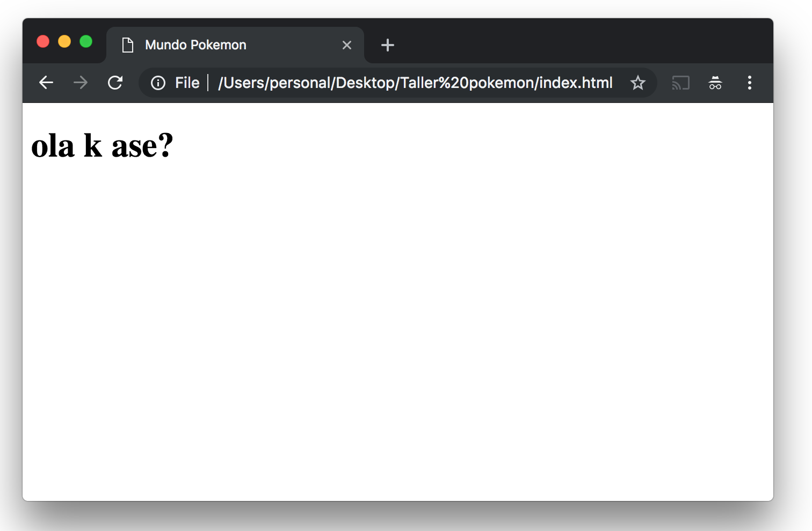
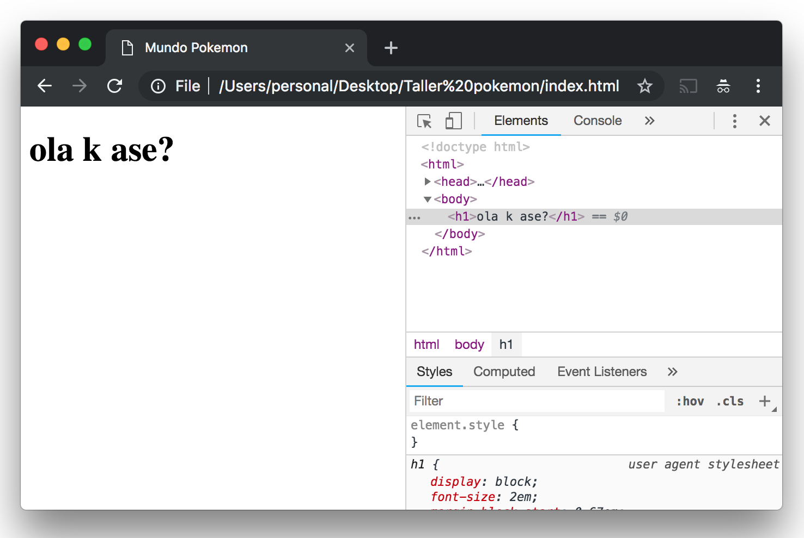
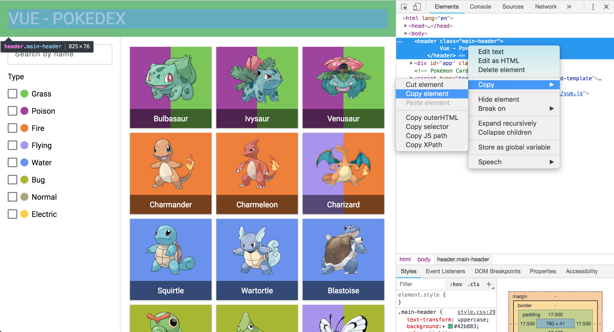
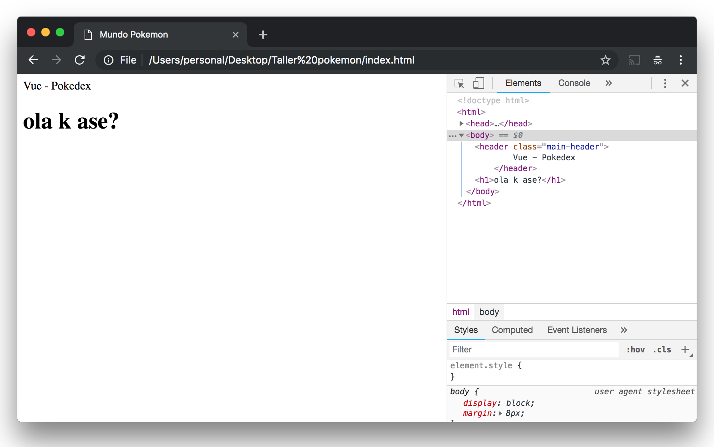

# HTML


## Índice

- [Introducción](README.md)
- HTML
- [CSS](CSS.md)
- [JavaScript](JavaScript.md)

Pues aquí vamos con el primer palabro raro! HTML significa HyperText Markup Language y es el primer lenguaje de programación que vamos a ver :) aunque de hecho... ya lo hemos visto! es el código que salía a la derecha y donde hemos cambiado el nombre del vídeo de Pikachu, si hacemos scroll hacia arriba del todo en cualquier web siempre nos vamos a encontrar lo mismo:

```html
<html>
    <head></head>
    <body></body>
</html>
```

donde en el `head` vamos a poner cosas relacionadas con la web que no se ven dentro del navegador como por ejemplo un `title` que va a ser el título de la web en la pestaña del navegador y en el `body` vamos a poner todas las cosas que se ven (como el `header`, `main` y `aside` que hemos visto al principio) y bueno... todas estas palabras en inglés que estoy diciendo se llaman **etiquetas** de HTML y están en inglés pues por que el que inventó el lenguaje era inglés y el inglés es el idioma más internacional ahora mismo :)

### Práctica 2

Vamos a crear nuestra propia web donde escribiremos nuestro código HTML :). Para ello crea una carpeta en el escritorio llamada _pokedex_, ábrela con el VS Code y crea una archivo llamado `index.html` con la estructura básica de una página, esta es:

index.html
```html
<!DOCTYPE html>
<html>
<head>
    <title>Mundo pokemon</title>
</head>
<body>
    <h1>ola k ase?</h1>
</body>
</html>
```
guardamos y abrimos el archivo nos saldrá el navegador con algo tal que así:



Y voilà! ya tenemos nuestra primera página web!!! 🎉🎉

Bueno vale... no es que sea la web más elaborada que hayas visto nunca pero por algo se empieza! :D

De hecho puedes probar al igual que con la web de Youtube a hacer click en el __botón derecho -> inspeccionar__ para ver el código HTML que forma esta web (que es el mismo que hemos escrito antes)



### Header

Bueno, vamos a empezar a hacer nuestra web para pokemons, como hemos visto antes con la web de Youtube la web de pokemons también tiene 3 partes diferenciadas el `header`, el `main` y un `aside`, sabrías econtrarlos con el inspector [aquí](https://rubnvp.github.io/vue-pokedex/)? :)

Cuando lo encuentres copia el `header` dandole a "Copy element" (o "Copiar elemento"):



y pégalo justo antes del `<h1>ola k ase?</h1>` de forma que al final tu index.html queda como este:

index.html
```html
<!DOCTYPE html>
<html>
<head>
    <title>Mundo pokemon</title>
</head>
<body>
    <header class="main-header">
        Vue - Pokedex
    </header>
    <h1>ola k ase?</h1>
</body>
</html>
```

genial! pues guardamos, recargamos la página y tendríamos que ver algo como esto:



😐... bueno... quizá no es lo que esperábamos, no? amm... no sé... en la pagina de donde lo hemos copiado las letras son más grandes, el fondo es verde, ocupa todo el ancho de la pantalla... qué está pasando?

pues que nos falta nuestro amigo CSS que ahora veremos! :D

👉 Continúa en [CSS](CSS.md)