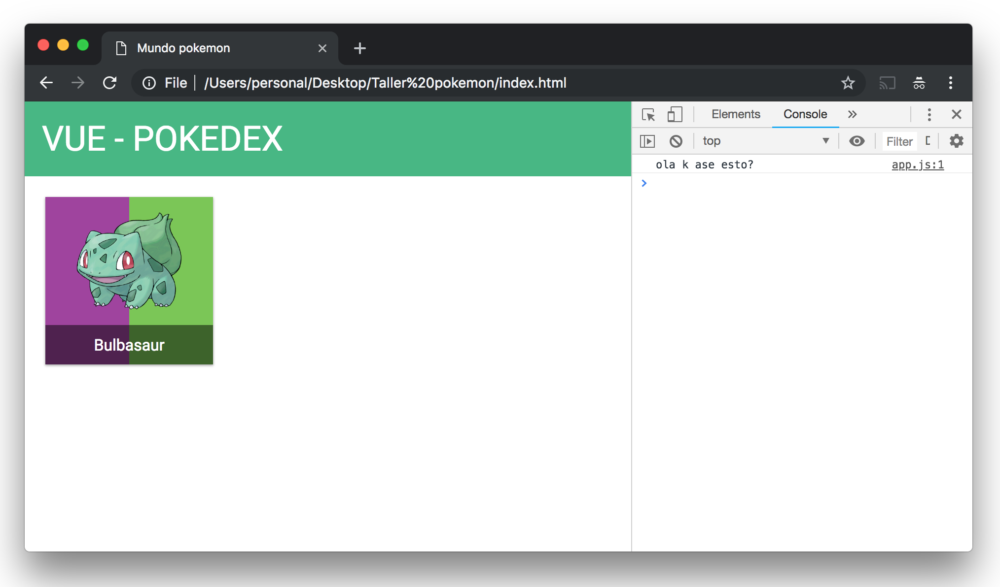
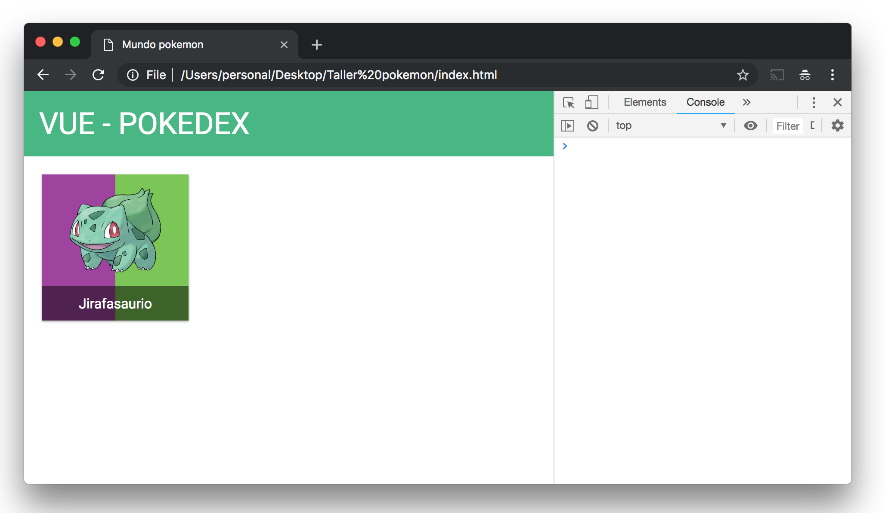
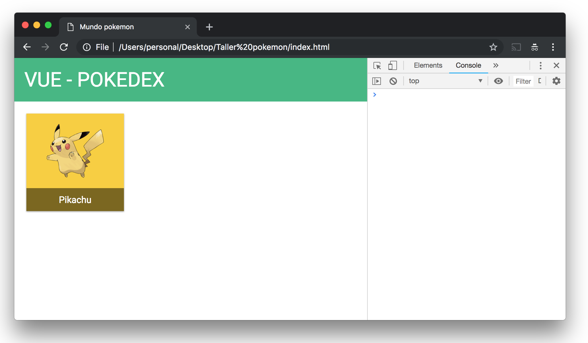
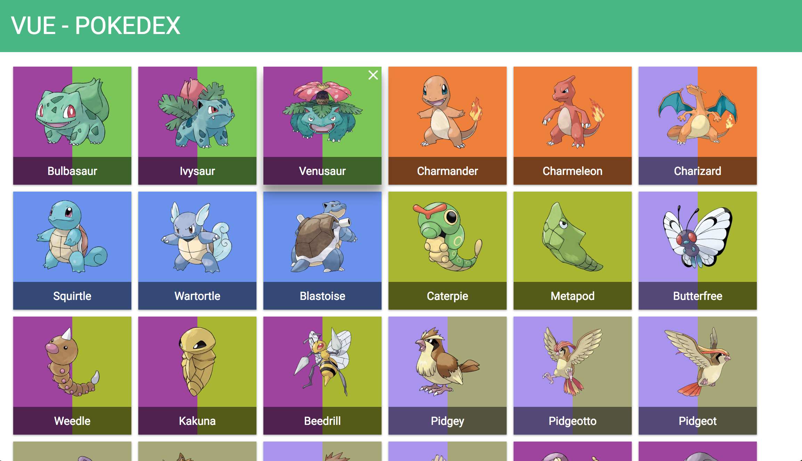

# JavaScript


## Índice

- [Introducción](README.md)
- [HTML](HTML.md)
- [CSS](CSS.md)
- JavaScript

Enhorabuena por llegar hasta aquí! seguro que tienes muchas dudas sobre le que acabamos de hacer y como funciona todo esto pero seguimos adelante con el último palabro del taller: JavaScript! 🙌

Personalmente es que el más me gusta de los 3 lenguajes ya que puedes hacer muchíiiiiiisimas cosas con él pero también suele ser el más dificil de aprender (aunque cuando le pillas el truco te prometo que mola usarlo 🤗).

¿Y qué hace JavaScript? pues si recuerdas de los dos anteriores lenguajes:
- _HTML_ sirve para colocar los elementos que se van a ver
- _CSS_ sirve para darle estilos a esos elementos (colores, tamaños, letras...)

Y ahora con JavaScript vamos a poder darle **funcionalidad** a los elementos del HTML, es decir, vamos a poder hacer que aparezcan o desaparezcan elementos si alguien pulsa un botón por ejemplo, o añadir nuevos elementos que antes no estaban o cualquier cosas que nos apetezca hacer en la página web! :D

## Práctica 6

Para poder programar en JavaScript le tenemos que indicar al HTML dónde se encuentra el fichero JS (como hacíamos con el CSS) para ello vamos a añadir las siguientes líneas justo antes de la etiqueta `</body>` (cuando se cierra, abajo del todo):

```html
    // ...
    <script src="app.js"></script>
</body>
```

y luego creamos el fichero app.js al lado del index.html:

app.js
```js
console.log('ola k ase esto?');
```

si todo ha salido bien deberías ver en el inspector de la web, en el apartado *Consola* el mensaje



enhorabuena! acabas de programar tu primer programa en JavaScript! 😄😄 (un programa que solo pone ese mensaje pero _it's something_)

¯\\\_(ツ)\_/¯

Pero como vamos a usar JavaScript con el HTML y esto a veces puede ser un poco... tramboliko! hay gente que ha escrito mucho código para simplificar este problema y lo junta todo en un fichero que se suele llamar **librería** (por que hay como mucho código escrito, como una biblioteca) y la librería que vamos a usar nosotros se llama **VueJS** (JS es la forma corta de escribir JavaScript) que es una que me gusta ya que nos hace las cosas un poco más fáciles :)

## VueJS 🖖


Pues bueno he hablado mucho de JavaScript, de VueJS y seguro que ya estás deseando ver más código, no? asi que... qué funcionalidad le añadimos a nuestra web?

\- pues la primera que salta a la vista es que solo tenemos un pokemon Rubén!!, vaya mi***a de Pokedex si solo tengo UNO! tanto trabajo para UN SOLO POKEMOOOOON!!!!

\- vale, vale! 😅 don't worry:


vamos primero a añadir el primer pokemon con VueJS y luego veremos qué sencillo es añadir el resto! :D

## Práctica 7

Para ello vamos a incluir Vue en el HTML para poder usarlo después colocando esta línea justo antes de la última que habíamos puesto (donde se incluía el app.js):

```html
<script src="https://unpkg.com/vue@2.6.8/dist/vue.min.js"></script>
```

de forma que nuestro `index.html` al final del todo se ve algo como así:

```html
    // ...
    <script src="https://unpkg.com/vue@2.6.8/dist/vue.min.js"></script>
    <script src="app.js"></script>
</body>
```

Y ahora vamos a poner el nombre del pokemon desde el `app.js`, para ello escribimos:

app.js
```js
var app = new Vue({
    el: '#app',
    data: {
        pokemon: {
            name: 'Jirafasaurio'
        }
    }
});
```

y en el `index.html` le indicamos donde tiene que colocar el nombre de "Jirafasaurio" poniendoselo entre dobles llaves y sustituyendo bulbasaur 🙂

```html
<div class="pokemon-title">
    {{ pokemon.name }}
</div>
```

de forma que si todo ha salido bien deberíamos ver esto ahora! :D



aunque bueno, Jirafasaurio no existe como pokemon 😅 así que vamos a empezar como empezó _Ash_ en pokemon: con un Pikachu! ⚡

para ello añadimos la información de Pikachu en el fichero app.js

app.js
```js
var app = new Vue({
    el: '#app',
    data: {
        pokemon: {
            name: 'pikachu',
            image: 'images/pokemons/pikachu.png',
            types: ['electric'],
            id: 25
        },
        typeColor: {}
    }
});
```

y sustituimos el HTML donde definíamos un pokemon por este otro:

```html
<div class="pokemon-card">
    <div class="background-wrapper">
        <div :style="{'background-color': COLOR[pokemon.types[0]]}"></div>
    </div>
    <span class="remove-pokemon"><i class="material-icons">close</i></span>
    <div class="image-wrapper">
        
    </div>
    <div class="pokemon-title">
        {{ pokemon.name }}
    </div>
</div>
```

si todo ha salido bien deberíamos ver ya ha pikachu asomandose por aquí :)


aunque si te fijas le falta el color de fondo, esto es por que en la información de Pikachu hemos puesto que es de tipo _electric_ pero en ninguna parte decimos que para tipo _electric_ debemos poner el fondo... amarillo por ejemplo? así que completamos en el JS los colores que debe pintar para cada tipo añadiendolos en `typeColor`:

```js
typeColor: {
    grass: '#78C850',
    poison: '#A040A0',
    fire: '#F08030',
    flying: '#A890F0',
    water: '#6890F0',
    bug: '#A8B820',
    normal: '#A8A878',
    electric: '#F8D030',
}
```



por cierto el color `#F8D030` es un amarillo, puedes comprobarlo [aquí](https://www.color-hex.com/color/f8d030). Y con esto ya hemos puesto a pikachu por JavaScript!

\- si si, muy bien pero Rubén! que seguimos solo con un maldito pokemon!! 😡

\- ya, ya! verás ahora la magia de JavaScript para poner todos los que queramos! :)

## Práctica 8

Entonces para poner un pokemon en la pantalla solo necesitamos su información básica en el JS, así que vamos a copiar de [aquí](../data/pokemons.json) todos los datos y los guardamos en un fichero llamado `pokemons.js` poniendo `var pokemons = ` justo antes de forma que quedaría así:

pokemons.js
```js
var pokemons = [
    {
       "id":1,
       "name":"bulbasaur",
       "image":"images/pokemons/bulbasaur.png",
       "types":[
          "poison",
// etc..
```

añadimos el nuevo fichero js en el index.html con la información de los pokemons justo antes del `app.js`:

```html
<script src="pokemons.js"></script>
<script src="app.js"></script>
```

hacemos referencia a ellos en el fichero app.js:

app.js
```js
var app = new Vue({
    el: '#app',
    data: {
        pokemons: pokemons,
        typeColor: {
            grass: '#78C850',
            poison: '#A040A0',
            fire: '#F08030',
            flying: '#A890F0',
            water: '#6890F0',
            bug: '#A8B820',
            normal: '#A8A878',
            electric: '#F8D030',
        },
    }
});
```

y reemplazamos la pokemon card por el siguiente código haciendo que el html de un pokemon se repita por cada pokemon usando el `v-for` que nos da Vue:

```html
<div class="pokemon-card" v-for="pokemon in pokemons" :key="pokemon.id">
    <div class="background-wrapper">
        <div v-for="type in pokemon.types" :key="type" :style="{'background-color': typeColor[type]}"></div>
    </div>
    <span class="remove-pokemon"><i class="material-icons">close</i></span>
    <div class="image-wrapper">
        
    </div>
    <div class="pokemon-title">
        {{ pokemon.name }}
    </div>
</div>
```

si todo ha salido bien veremos (ya por fin!) a todos nuestros pokemons en la web :)



y felicidades!! si has llegado hasta aquí acabas de crear una pequeña Pokedex donde mostrar tus pokemons 🎉🎉 😊

Mas adelante añadiré en este tutorial los filtros de la izquierda (búsqueda por nombre y filtro por tipo) para poder buscar rápidamente a nuestros pokemons!

Nos Vuemos! 🖖