# Mundo Pokémon con HTML, CSS y VueJS 🐁🐙🐛🐟

## Hola! :D

te doy la bienvenida a este taller donde iremos montando paso a paso una pequeña Pokedex en una pagina web e iremos viendo cómo funcionan las tecnologías con las que se hacen webs actualmente :)

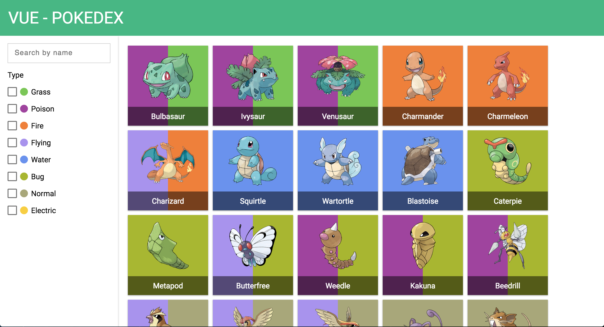

el resultado final puedes verlo [aquí](https://rubnvp.github.io/vue-pokedex/) aunque tardaremos un poco en llegar a él.

## Instalación de VS Code 🏗️

Antes que nada vamos a instalar un pequeño programa para escribir código, es el Visual Studio Code (VS Code) y puedes descargarlo [aquí](https://code.visualstudio.com/download), si necesitas ayuda con la instalación pregunta!

## ¿Cómo está hecha una web?

Vamos a ver como está hecha una web por dentro, piensa en una página, uhmmm... por ejemplo... Youtube?

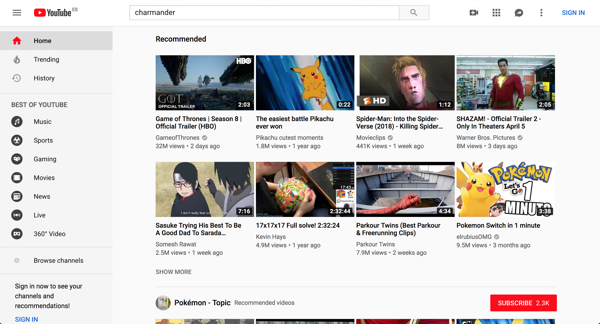

Si te fijas, aunque las webs pueden ser de cualquier forma, normalmente casi todas tienen una estructura parecida, es decir, arriba tenemos una barra con el logo y demás cosas, que llamaremos `header`:

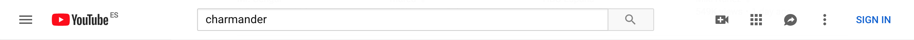

luego está la parte central con el contenido que más nos interesa, a esta parte la llamaremos `main`:


y por último a veces hay una barra a la izquierda o derecha con varias opciones y para ir a otras partes de la web, a esta la llamamos `aside`:

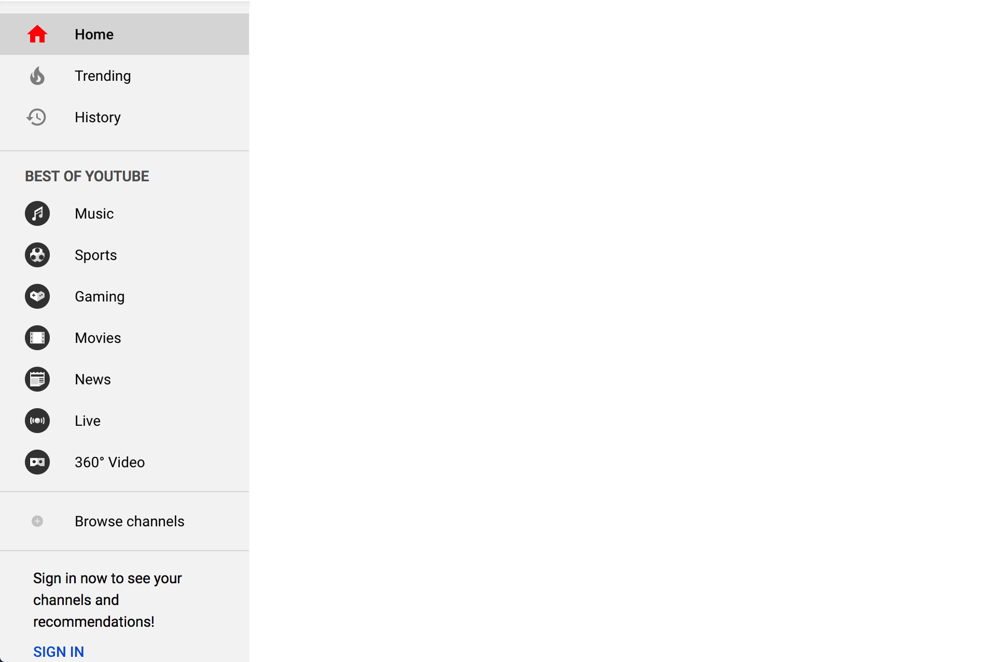

\- vale pero... pa k kieres saber eso?

\- pues por si todavía no te habías dado cuenta después de tanto tiempo en internet!

## Inspeccionando una web... 🔍

Vale pues ahora que sabemos un poco las partes de una web vamos a "hackear" un poco 👩‍💻👨‍💻.

Con el botón derecho del ratón hacemos click en alguna parte de la web de Youtube y saldrá un menú parecido a este:


tenemos que hacer click en donde pone "Inspect" (o a lo mejor pone "Inspeccionar", "Inspeccionar elemento" o algo así), entonces se nos abre una ventana como esta:

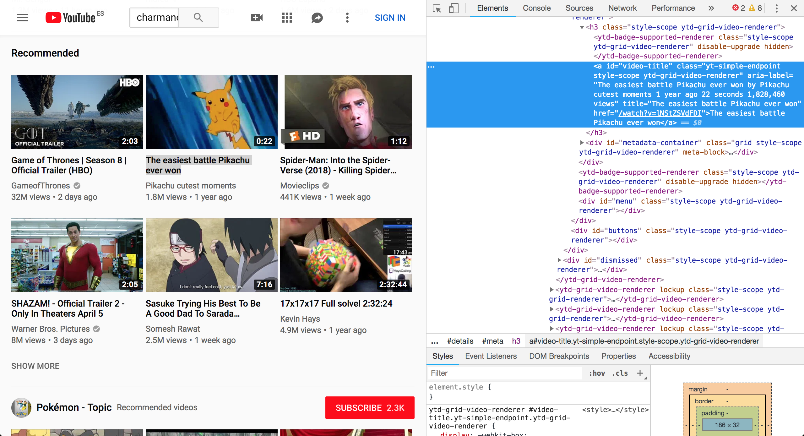

WHAAATTT? 😱 da un poco de miedo no? no te preocupes :D, no se ha roto nada, tan solo estamos viendo "las tripas" de una web y como está estructurada por dentro. De hecho hasta puedes cambiar cosas, quitar trozos, modificar textos... etc

### Práctica 1 

Vamos a probar a cambiar por ejemplo el título del vídeo ese de Pikachu por algo así como "Pikachu pensando en chucherías", haciendo doble-click en el último título lo podemos cambiar por algo así:

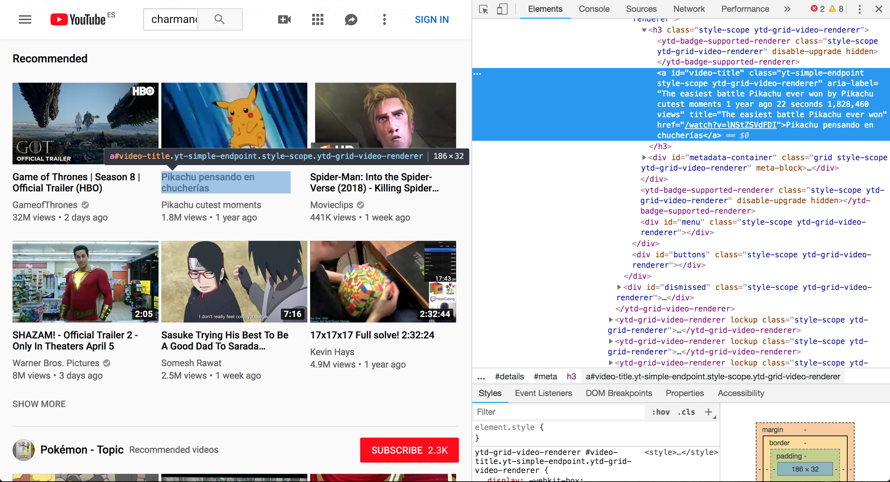

y cambiado! aunque bueno... en verdad no hemos hackeado nada 😅, solo lo hemos cambiado en nuestro ordenador y si actualizas la página todos los cambios desaparecen 😕 no iba a ser tán fácil hackear una pagina, no? 😁

## HTML

Pues aquí vamos con el primer palabro raro! HTML significa HyperText Markup Language y es el primer lenguaje de programación que vamos a ver :) aunque de hecho... ya lo hemos visto! es el código que salía a la derecha y donde hemos cambiado el nombre del vídeo de Pikachu, si hacemos scroll hacia arriba del todo en cualquier web siempre nos vamos a encontrar lo mismo:

```html
<html>
    <head></head>
    <body></body>
</html>
```

donde en el `head` vamos a poner cosas relacionadas con la web que no se ven dentro del navegador como por ejemplo un `title` que va a ser el título de la web en la pestaña del navegador y en el `body` vamos a poner todas las cosas que se ven (como el `header`, `main` y `aside` que hemos visto al principio) y bueno... todas estas palabras en inglés que estoy diciendo se llaman **etiquetas** de HTML y están en inglés pues por que el que inventó el lenguaje era inglés y el inglés es el idioma más internacional ahora mismo :)

### Práctica 2

Vamos a crear nuestra propia web donde escribiremos nuestro código HTML :). Para ello crea una carpeta en el escritorio llamada _pokedex_, ábrela con el VS Code y crea una archivo llamado `index.html` con la estructura básica de una página, esta es:

index.html
```html
<!DOCTYPE html>
<html>
<head>
    <title>Mundo pokemon</title>
</head>
<body>
    <h1>ola k ase?</h1>
</body>
</html>
```
guardamos y abrimos el archivo nos saldrá el navegador con algo tal que así:


Y voilà! ya tenemos nuestra primera página web!!! 🎉🎉

Bueno vale... no es que sea la web más elaborada que hayas visto nunca pero por algo se empieza! :D

De hecho puedes probar al igual que con la web de Youtube a hacer click en el __botón derecho -> inspeccionar__ para ver el código HTML que forma esta web (que es el mismo que hemos escrito antes)


### Header

Bueno, vamos a empezar a hacer nuestra web para pokemons, como hemos visto antes con la web de Youtube la web de pokemons también tiene 3 partes diferenciadas el `header`, el `main` y un `aside`, sabrías econtrarlos con el inspector [aquí](https://rubnvp.github.io/vue-pokedex/)? :)

Cuando lo encuentres copia el `header` dandole a "Copy element" (o "Copiar elemento"):


y pégalo justo antes del `<h1>ola k ase?</h1>` de forma que al final tu index.html queda como este:

index.html
```html
<!DOCTYPE html>
<html>
<head>
    <title>Mundo pokemon</title>
</head>
<body>
    <header class="main-header">
        Vue - Pokedex
    </header>
    <h1>ola k ase?</h1>
</body>
</html>
```

genial! pues guardamos, recargamos la página y tendríamos que ver algo como esto:


😐... bueno... quizá no es lo que esperábamos, no? amm... no sé... en la pagina de donde lo hemos copiado las letras son más grandes, el fondo es verde, ocupa todo el ancho de la pantalla... qué está pasando?

pues que nos falta nuestro amigo CSS que ahora veremos! :D

## CSS

Y aquí viene el segundo palabro raro! CSS significa Cascading Style Sheets y es el segundo lenguaje de programación que vamos a ver :) aunque de hecho... también lo hemos visto! estaba escondido debajo del HTML, justo aquí:

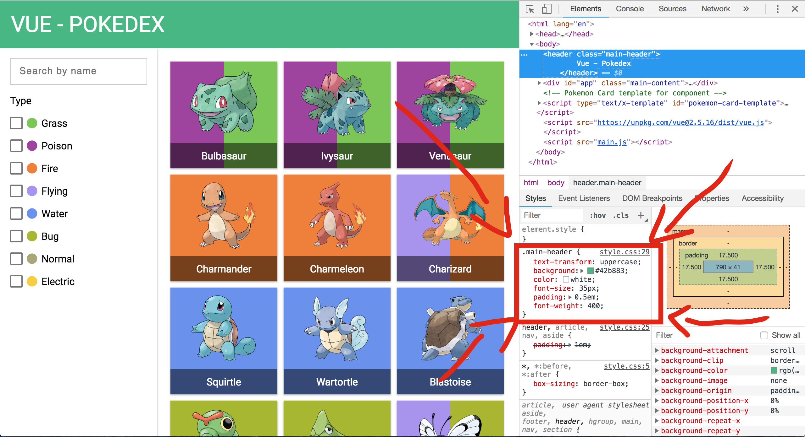

y es que CSS es el lenguaje de programación que nos va a ayudar a __dar estilos__ a nuestro HTML, esto quiere decir que cosas como los colores, tamaño, tipo de letra, posición... en general lo que hace "que se vea bien" una web está hecho con CSS.

### Práctica 3

Para añadir el CSS vamos a que crear un fichero que vamos a llamar `style.css` y vamos a guardar unos estilos iniciales:

style.css
```css
.main-header {
    text-transform: uppercase;
    background: #42b883;
    color: white;
    font-size: 35px;
    padding: 0.5em;
    font-weight: 400;
}
```

pero si probamos a guardar y recargar la web no ocurrirá nada, esto es por que le tenemos que decir al html dónde se encuentra el archivo CSS y para ello justo después de la etiqueta `<title>Mundo pokemon</title>` añadimos:

```html
<link rel="stylesheet" href="style.css">
```

de forma que ahora sí, guardamos, recargamos y debería salir algo como esto:

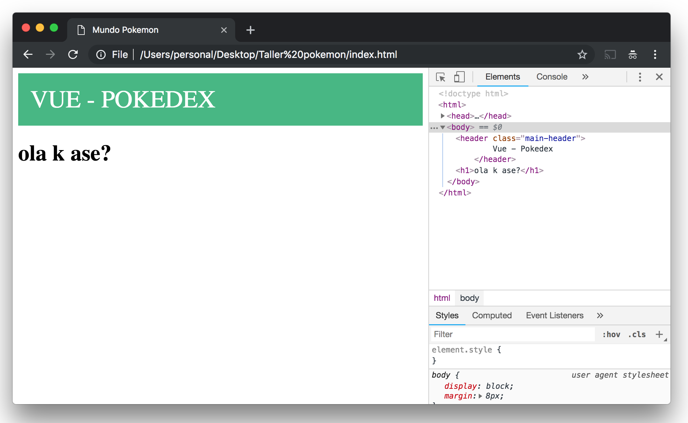

si te fijas, la forma que tiene el CSS de saber a que parte del HTML afecta es con la marca que hemos puesto en el html `class=main-header` que se relaciona con el css `.main-header`.

y si añadimos un poco más de estilos como estos:

```css
@import url('https://fonts.googleapis.com/css?family=Roboto:400,700');
@import url('https://fonts.googleapis.com/icon?family=Material+Icons');

body {
    font-family: 'Roboto', sans-serif;
    display: flex;
    min-height: 100vh;
    flex-direction: column;
    margin: 0;
}

header, article, nav, aside {
    padding: 1em;
}

.main-header {
    text-transform: uppercase;
    background: #42b883;
    color: white;
    font-size: 35px;
    padding: 0.5em;
    font-weight: 400;
}
```

conseguiremos que quede como en la página original :)

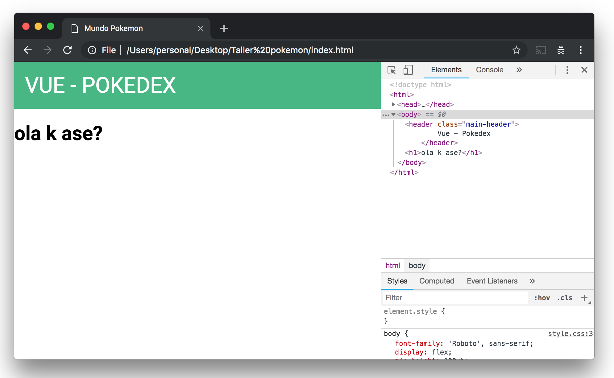

perfecto pues ya tenemos nuestro header completo!! 🎉🎊🙌

¿serías capaz de hacer las letras un poco más pequeñas y de cambiar el color de fondo por un azul? :)

## Añadiendo a Bulbasaur

Pues por fin van a aparecer los pokemon!, como hemos visto anteriormente los vamos a poner en el `main` de la web.

### Práctica 4

Quitamos la etiqueta `h1` con el 'ola k ase?' y la sustituimos por la etiqueta `main` junto con un `article` con la class `pokemons-list` tal que así:

index.html
```html
<!DOCTYPE html>
<html>
<head>
    <title>Mundo pokemon</title>
    <link rel="stylesheet" href="style.css">
</head>
<body>
    <header class="main-header">
        Vue - Pokedex
    </header>
    <main class="main-view">
        <article class="pokemons-list">
    
        </article>
    </main>
</body>
</html>
```

dentro de `pokemons-list` es donde van a aparecer los pokemon así que vamos a probar a poner uno, cuyo código HTML sería:

```html
<div class="pokemon-card">
    <div class="background-wrapper">
        <div style="background-color: rgb(160, 64, 160);"></div>
        <div style="background-color: rgb(120, 200, 80);"></div>
    </div>
    <span class="remove-pokemon"><i class="material-icons">close</i></span>
    <div class="image-wrapper">
        
    </div>
    <div class="pokemon-title">
        bulbasaur
    </div>
</div>
```

por lo que colocando el código anterior correctamente y guardando deberíamos ver algo como esto:


y... bueno... no parece que esté funcionando, no? 😅

### Práctica 5

esto es por que le falta la imagen de bulbasaur, no la encuentra, puedes encontrar las imágenes [aquí](images.zip) descárgatelas y descomprime la carpeta al lado del index.html, una vez hecho esto la web se debería ver así:

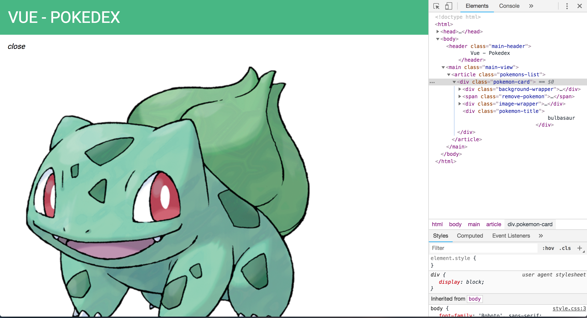

donde sale enorme el Bulbasaur! :O así que para darle un tamaño adecuado, así como los colores de fondo y poner más bonitas las letras tenemos que...

... CSS! para esto estaba el CSS! :)

así que añadimos a nuestro código CSS las siguientes líneas:

```css
.pokemons-list {
    flex: 1;
    display: flex;
    flex-wrap: wrap;
    overflow-y: auto;
}

/* Pokemon card */
.pokemon-card {
    margin: 5px;
    position: relative;
    height: 170px;
    width: 170px;
    display: flex;
    flex-direction: column;
    text-align: center;
    color: white;
    box-shadow: 0 1px 3px rgba(0,0,0,0.12), 0 1px 2px rgba(0,0,0,0.24);
    transition: all 0.3s cubic-bezier(.25,.8,.25,1);
    overflow: hidden;
}

.pokemon-card:hover {
    box-shadow: 0 14px 28px rgba(0,0,0,0.25), 0 10px 10px rgba(0,0,0,0.22);
}

.pokemon-card .background-wrapper {
    position: absolute;
    width: 100%;
    height: 100%;
    display: flex;
    z-index: -1;
}

.pokemon-card .background-wrapper div {
    flex-grow: 1;
}

.pokemon-card .remove-pokemon {
    display: none;
    position: absolute;
    top: 0;
    right: 0;
    cursor: pointer;
}

.pokemon-card:hover .remove-pokemon {
    display: inline-block;
}

.pokemon-card .remove-pokemon:hover {
    background-color: rgba(255, 255, 255, 0.2);
}

.pokemon-card .image-wrapper {
    flex-grow: 1;
    display: flex;
    justify-content: center;
    align-items: center;
}

.pokemon-card .pokemon-image {
    height: 110px;
}

.pokemon-card .pokemon-title {
    height: 40px;
    background-color: rgba(0,0,0,.5);
    display: flex;
    justify-content: center;
    align-items: center;
    text-transform: capitalize;
}
/* End Pokemon card */
```

y pufff!! son muchas, y parecen muy complicadas, ya habrá otro día para llegar a entender todo lo que pone! :) lo importante es que gracias a esas líneas de CSS ahora nuestra web se nos ve así:

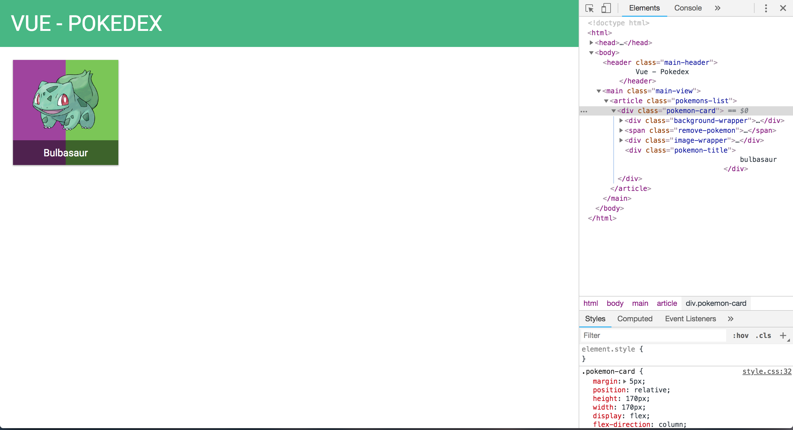

genial! ya hemos conseguido añadir a nuestro primer pokemon! 🎉💃🕺🎉