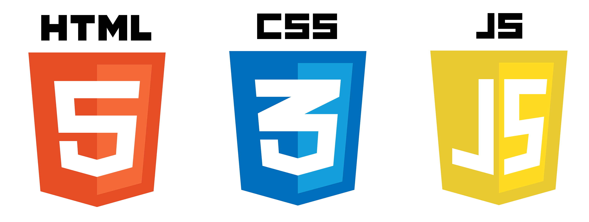
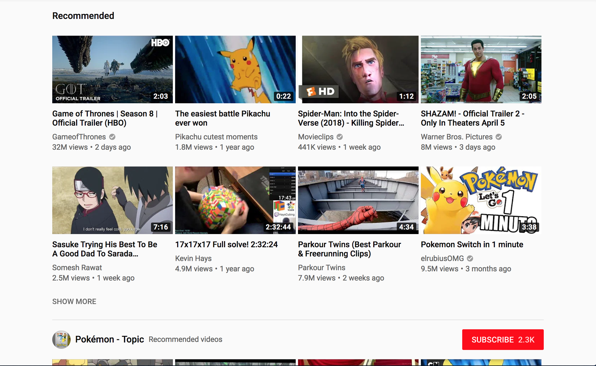
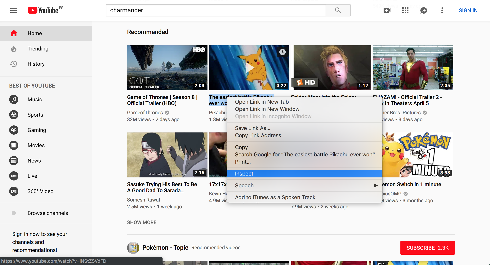

# Mundo Pokémon con HTML, CSS y JavaScript 🐁🐙🐛🐟

Link: [bit.do/taller-pokedex](http://bit.do/taller-pokedex)

## Índice

- Introducción
- [HTML](HTML.md)
- [CSS](CSS.md)
- [JavaScript](JavaScript.md)

## Hola! :D

te doy la bienvenida a este taller donde iremos montando paso a paso una pequeña Pokedex en una pagina web e iremos viendo cómo funcionan las tecnologías con las que se hacen webs actualmente :)

el resultado final puedes verlo [aquí](https://rubnvp.github.io/vue-pokedex/) aunque tardaremos un poco en llegar a él.

## Instalación de VS Code 🏗️

Antes que nada vamos a instalar un pequeño programa para escribir código, es el Visual Studio Code (VS Code) y puedes descargarlo [aquí](https://code.visualstudio.com/download), si necesitas ayuda con la instalación pregunta!

## ¿Cómo está hecha una web?

Vamos a ver como está hecha una web por dentro, piensa en una página, uhmmm... por ejemplo... Youtube?

Si te fijas, aunque las webs pueden ser de cualquier forma, normalmente casi todas tienen una estructura parecida, es decir, arriba tenemos una barra con el logo y demás cosas, que llamaremos `header`:

luego está la parte central con el contenido que más nos interesa, a esta parte la llamaremos `main`:

y por último a veces hay una barra a la izquierda o derecha con varias opciones y para ir a otras partes de la web, a esta la llamamos `aside`:

\- vale pero... pa k kieres saber eso?

\- pues por si todavía no te habías dado cuenta después de tanto tiempo en internet!

## Inspeccionando una web... 🔍

Vale pues ahora que sabemos un poco las partes de una web vamos a "hackear" un poco 👩‍💻👨‍💻.

Con el botón derecho del ratón hacemos click en alguna parte de la web de Youtube y saldrá un menú parecido a este:

tenemos que hacer click en donde pone "Inspect" (o a lo mejor pone "Inspeccionar", "Inspeccionar elemento" o algo así), entonces se nos abre una ventana como esta:

WHAAATTT? 😱 da un poco de miedo no? no te preocupes :D, no se ha roto nada, tan solo estamos viendo "las tripas" de una web y como está estructurada por dentro. De hecho hasta puedes cambiar cosas, quitar trozos, modificar textos... etc

### Práctica 1 

Vamos a probar a cambiar por ejemplo el título del vídeo ese de Pikachu por algo así como "Pikachu pensando en chucherías", haciendo doble-click en el último título lo podemos cambiar por algo así:

y cambiado! aunque bueno... en verdad no hemos hackeado nada 😅, solo lo hemos cambiado en nuestro ordenador y si actualizas la página todos los cambios desaparecen 😕 no iba a ser tán fácil hackear una pagina, no? 😁

👉 Continúa en [HTML](HTML.md)